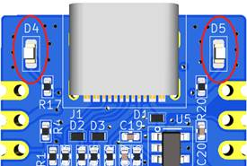
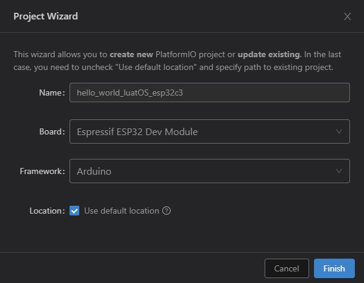

## LEDs
D4 IO12  
D5 IO13  

diodes are active HIGH



## Platform IO settings

Note that the board is a generic ESP32 Dev Module, the specific module will be configured in the platform.ini file



## platform.ini
```ini
[env:esp32dev]
platform = espressif32  
board = esp32dev  
framework = arduino  
board_build.mcu = esp32c3  
board_build.f_cpu = 80000000L  
monitor_speed = 115200  

; the following build flags are required for USB serial output  
build_flags =   
   -DARDUINO_USB_MODE=1  
   -DARDUINO_USB_CDC_ON_BOOT=1  
```
